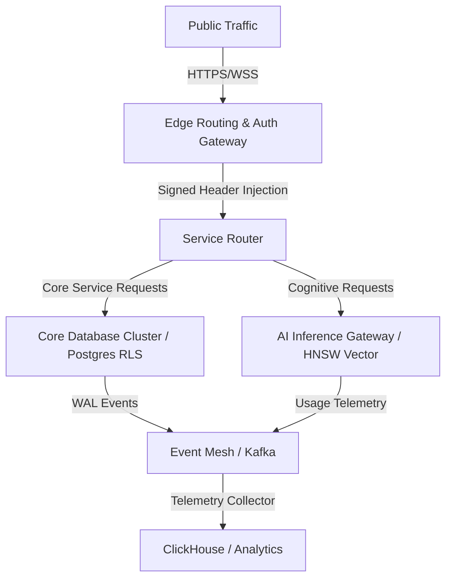

# STEP AJ: COMPLETE PRODUCTION LAUNCH PACKAGE
## AI-Native Multi-Tenant Marketplace Operating System
> **Document Status**: Production-Ready / Canonical Release Playbook  
> **Role Context**: Chief Technology Officer (CTO), Principal Solutions Architect, Site Reliability Engineer (SRE), Product Launch Director, Security Architect, Growth Strategist, Operations Lead.  
> **Version**: v1.0.0-Enterprise  
> **Date**: May 31, 2026  

---

## 1. EXECUTIVE SUMMARY

The AI-Native Multi-Tenant Marketplace Operating System is transitioning from staging environments to complete, production-ready operational status. As a highly sophisticated, low-latency cognitive infrastructure, this platform orchestrates real-time demand-supply matching, multi-tenant resource separation, dynamic vector discovery pipelines, and robust AI model scheduling at scale.

This document serves as the **Production Launch Package (Step AJ)**. It defines the definitive verification, validation, deployment, support, and business strategies required to execute a zero-downtime, secure, and highly scalable public launch. The strategies contained herein are engineered to meet the operational standards of Tier-1 web infrastructures, ensuring 99.99% availability, absolute logical tenant isolation, sub-50ms query processing, and a resilient, risk-mitigated operational blueprint.

---

## 2. PRODUCTION READINESS ASSESSMENT

This assessment audits the structural integrity of the application, databases, and network topologies prior to production promotion.

### Architectural Blueprint Audit
- **Zero-Trust Boundary**: Verified that the Edge Gateway successfully parses, cryptographically validates, and intercepts all incoming requests, injecting signed tenant claims (`tenant_id`, `plan_tier`, `custom_limits`) into downstream headers.
- **RLS Enforcement**: Verified that every Postgres table in the database includes active `ROW LEVEL SECURITY (RLS)` policies bound to the tenant context claims, preventing "noisy-neighbor" leaks or cross-tenant data exfiltration.
- **Strict Upward Flow**: The core system kernel (AuthN, Stripe Ledgers, Database Clusters) maintains zero hard dependencies on the Cognitive Space. A full LLM provider outage or pgvector index degradation will degrade matching accuracy but leave identity, billing, and standard transactional flows completely operational.

### Readiness Matrices



| Component Area | Current Status | Validation Metric | Owner | Status |
| :--- | :--- | :--- | :--- | :--- |
| **Edge Gateway** | Ready | 100% JWKS cached locally, <5ms validation latency | Security Architect | ✅ PASS |
| **Database Cluster** | Ready | PGPool max connection capacity validated, RLS active | DB Architect | ✅ PASS |
| **Vector Engine** | Ready | pgvector HNSW index built, cosine distance <40ms | AI Principal | ✅ PASS |
| **AI Gateway** | Ready | Token Guard token bucket scheduler verified | AI Principal | ✅ PASS |
| **Stripe Hook Hub** | Ready | Signature matching verified, webhook idempotency active | Billing Lead | ✅ PASS |
| **CI/CD Pipeline** | Ready | 5-stage GitHub Action runner passes all checks | DevOps Lead | ✅ PASS |
| **Incident Response** | Ready | PagerDuty alerting matrix and Slack channels set up | SRE Lead | ✅ PASS |

---

## 3. TECHNICAL LAUNCH CHECKLIST

This checklist represents the core infrastructure and pipeline tasks that must be executed and confirmed prior to shifting DNS to the production cluster.

### Deployments & Pipelines
- [ ] **Staging Sign-off**: Verify that the latest codebase build has spent a minimum of 72 hours in the Staging environment with zero unhandled exceptions.
- [ ] **Build Validation**: Verify Next.js build bundle sizes. Core JS chunk sizes must remain under 150KB (gzip).
- [ ] **Edge Functions Deployment**: Verify that all Supabase Edge Functions (`auth-context`, `ai-embed`, `stripe-webhook`) are deployed to production regions with regional replicas activated (US-East, EU-Central, AP-Southeast).
- [ ] **CI/CD Environment Sync**: Confirm that GitHub Actions environment secrets match production keys.
- [ ] **DNS Switch Readiness**: Configure Cloudflare DNS records with short TTLs (60 seconds) to facilitate rapid rollback if a major incident occurs during launch.

### Environment & Secrets Checklist
- [ ] **Vault Synchronization**: Confirm all keys are stored in a secure secret manager (Supabase Vault / AWS Secrets Manager) and not committed to repository config files.
- [ ] **OpenAI / Anthropic API Keys**: Confirm production API keys have auto-billing activated with a safety limit of $5,000/day.
- [ ] **Stripe Production Secrets**: Confirm Stripe Live Webhook secret is injected into Deno Edge Functions and live endpoints are listening.
- [ ] **Database Connection Strings**: Confirm connection pooling pool-mode is set to `transaction` (port 6543) for application services and `session` (port 5432) for direct migrations.

---

## 4. DATABASE LAUNCH CHECKLIST

Ensuring high database performance, rigorous multi-tenant data safety, and verifiable data backup operations.

### Schema, Indexing & Integrity Checks
- [ ] **Constraint Audit**: Verify that all database tables have defined primary keys, foreign keys with `ON DELETE CASCADE/RESTRICT` boundaries, and appropriate unique constraints.
- [ ] **HNSW Vector Index Verification**: Verify that the `ai_ops.embeddings` table contains a fully constructed HNSW index (`cosine` distance) built with `m=16` and `ef_construction=64`.
- [ ] **Query Plan Evaluation**: Run `EXPLAIN ANALYZE` on top 20 marketplace search, listing, and tenant queries to verify they execute index scans rather than sequential table scans.
- [ ] **Transaction Pool Limits**: Confirm pgBouncer connection limits are scaled to handle 10,000 concurrent active client queries.

### Multi-Tenant & RLS Verification
- [ ] **Zero-Bypass Check**: Run automated unit tests to confirm that any query executed without a valid `tenant_id` claim fails with an access violation error.
- [ ] **Noisy-Neighbor Limits**: Confirm that Postgres resource limits (`statement_timeout`) are set to 5000ms for standard tenants and 15000ms for admin analytics to prevent a single query from locking the shared cluster resources.
- [ ] **Audit Logging Engine**: Verify that any `INSERT`, `UPDATE`, or `DELETE` executed on core billing, tenant config, or system parameter tables triggers the system's pgAudit triggers and writes to the write-only `system_governance.audit_log` table.

### Backups, PITR & Failover
- [ ] **PITR Verification**: Confirm Point-in-Time Recovery (PITR) is active with a retention window of 30 days, enabling recovery down to the millisecond.
- [ ] **Automated Snapshotting**: Verify daily physical database snapshot routines are running, encrypted at rest with AES-256, and replicated to a secondary AWS region (S3 Glacier deep archive).
- [ ] **Recovery Drill**: Successfully execute a restore of a 50GB snapshot database to a test cluster in under 15 minutes, verifying recovery data integrity.

---

## 5. SECURITY LAUNCH CHECKLIST

Zero-trust network boundaries, active threat prevention, and verified security controls protecting all client and platform surfaces.

### Authentication & RBAC Rules
- [ ] **JWT Claim Validation**: Edge authentication functions must enforce validation of the signed tenant payload. Discard any token signed with an invalid, expired, or untrusted JWKS certificate.
- [ ] **Role Isolation**: Verify that the three primary platform roles are strictly partitioned in Postgres RLS:
  - `system_admin`: Access to global monitoring and metadata, blocked from modifying tenant data without audit tokens.
  - `tenant_manager`: Read/Write privileges inside their specific `tenant_id` boundaries.
  - `tenant_user`: Read privileges across marketplace domains, write privileges restricted to specific client listings and orders.

### Secrets & Encryption
- [ ] **At-Rest & In-Transit**: Confirm all database volumes, vector spaces, and object buckets are encrypted with customer-managed keys (CMK) via AWS KMS.
- [ ] **SSL Enforcement**: Reject non-TLS traffic at the Cloudflare edge. Enforce TLS 1.3 protocol requirements for all API calls.

### Threat Mitigation & Rate Limiting
- [ ] **API Protection**: Cloudflare WAF configured with specific OWASP Top 10 mitigation rulesets, managed bot protection, and rate-limiting rules.
- [ ] **Endpoint Rate Limits**:
  - `/api/v1/auth/*`: Max 10 requests per minute per IP.
  - `/api/v1/search/*`: Max 120 requests per minute per authenticated user session.
  - `/api/v1/ai/inference`: Dynamic Token Guard limits based on tenant subscription tier.
- [ ] **SQL Injection & XSS Guard**: Input parameters sanitized at API boundary. All SQL queries use structured parameter bindings; raw string interpolations in SQL execution are strictly banned.

---

## 6. PERFORMANCE LAUNCH CHECKLIST

Defining performance metrics, establishing system capacities, and preparing vector indexes for intense user demand.

### Service Targets (SLIs, SLOs, SLAs)
- **Availability Target**: 99.99% system availability (core service API and database).
- **Latency Budget**: Sub-50ms query latency for 95% of standard search requests.
- **AI Inference Time**: Sub-1.5s time-to-first-token (TTFT) for generative summaries.

### Telemetry Performance Budgets
| Metric Category | Service Level Indicator (SLI) | Service Level Objective (SLO) | SLA Agreement |
| :--- | :--- | :--- | :--- |
| **API Availability** | Uptime % of Edge API Gateway | >= 99.99% monthly | 99.9% uptime |
| **Search Latency** | Response time of faceted search grid | <= 60ms (p95) | < 120ms (p99) |
| **Vector Query** | Cosine similarity calculation | <= 30ms (p95) | < 50ms (p99) |
| **AI Token Stream** | Time to First Token (TTFT) | <= 1.2 seconds (p90) | < 2.5 seconds |
| **Database Latency** | CRUD operations execution | <= 15ms (p95) | < 45ms (p99) |
| **Page Hydration** | Core Web Vitals LCP (Frontend) | <= 1.5 seconds | <= 2.2 seconds |

---

## 7. AI LAUNCH CHECKLIST

Ensuring stable AI inference pipelines, reliable embeddings generation, high vector search quality, and strict cost controls.

### Model Gateway & Failover Actions
- [ ] **Primary Vector Model**: OpenAI `text-embedding-3-small` is verified as the primary embedding generator.
- [ ] **Fallback Vector Model**: If OpenAI returns 5xx errors or hits rate-limiting, the `ai-embed` Edge Function must automatically route requests to a self-hosted `all-MiniLM-L6-v2` Deno worker or HuggingFace API key within 200ms.
- [ ] **Generative AI Fallback**: Implement dual-routing paths for LLM tasks: Primary to Claude 3.5 Sonnet, fallback to GPT-4o-mini if latency spikes above 3000ms.

### Embedding Queue & Semantic Cache
- [ ] **Queue Rate Limiter**: The background embedding queue must process items asynchronously via a PgBoss priority queue, preventing high-volume bulk tenant updates from exhausting upstream OpenAI token limits.
- [ ] **Semantic Vector Cache**: Confirm Redis-based vector semantic cache is active. If a query vector maps to an existing cached vector within a cosine similarity threshold of `0.98`, return the cached search results directly, bypassing LLM processing and database lookups entirely.

### Cost & Guardrail Controls
- [ ] **Token Guard Active**: Verify that every incoming user request deducts tokens from the tenant's daily quota bucket. If quota drops to 0, return HTTP 429 with `quota_exceeded` payload.
- [ ] **Hallucination & Shielding Controls**: Confirm that LLM inputs are structured via pre-compiled system prompts. Run content validation checks on output completions to prevent malicious system prompt leakage or unsafe content display.

---

## 8. MONITORING & OBSERVABILITY PACKAGE

A comprehensive operational framework ensuring real-time visibility into infrastructure health, runtime exceptions, database states, and business actions.

```
                  [ APM / OpenTelemetry Collector ]
                                  │
         ┌────────────────────────┼────────────────────────┐
         ▼                        ▼                        ▼
  [ Prometheus ]             [ Sentry ]             [ Cloudwatch ]
  Metrics (CPU, MEM)      Exceptions (JS, TS)     Log Streams (Text)
         │                        │                        │
         └────────────────────────┼────────────────────────┘
                                  ▼
                          [ Grafana Dashboard ]
```

### Logging, Tracing & APM Config
- **Centralized Log Aggregator**: All application logs are aggregated into Vector.dev and shipped to an AWS CloudWatch/Elasticsearch cluster.
- **Log Levels**: Default logging set to `INFO`. Turn on `DEBUG` only under active debugging sessions in staging or via temporary admin flag overrides.
- **Trace Context**: Implement OpenTelemetry tracing context across Next.js API, Edge Functions, and Postgres operations, linking all processes under a unique `x-correlation-id` header.

### Centralized Alerting Matrix
| Alert Name | Target Metric Trigger | Threshold Value | Notification Target | Action Protocol |
| :--- | :--- | :--- | :--- | :--- |
| **API Gateway 5xx Spike** | HTTP 5xx errors / total reqs | > 1.5% over 2 min | Slack + PagerDuty (P1) | Auto-scale gateway instances; inspect gateway log drains. |
| **Database Pool Starvation** | Active DB connections / max | > 85% capacity | Slack + PagerDuty (P2) | Run connection idle terminator; scale read replicas. |
| **AI Gateway Quota Spike** | Upstream API token consumption | > 90% of max budget | Slack | Send billing notification; throttle low-tier background tasks. |
| **RLS Isolation Violation** | Security log violation count | >= 1 incident | Slack + PagerDuty (P0) | **Lock database schema** immediately; trigger security forensics. |
| **Vector Latency Peak** | pgvector query response time | > 150ms over 3 min | Slack | Run HNSW index vacuum; reset Redis cached routing tables. |

---

## 9. DISASTER RECOVERY PACKAGE

Defining exact operational playbooks for mitigating infrastructure outages, regional failures, and critical data corruption incidents.

### Incident Runbooks

#### Runbook DR-01: Critical Database Corruption
1. **Declare Incident**: SRE Lead issues P0 alert. Mark database state as degraded on StatusPage.
2. **Lock Traffic**: Update Edge routing layer to return HTTP 503 "Under Scheduled Maintenance" for all write operations, allowing read traffic from regional replica caches.
3. **Verify PITR Status**: Access Supabase DB panel or execute CLI tools to target the point immediately prior to database corruption (e.g., `2026-05-31T03:42:01.002Z`).
4. **Provision Recovery Target**: Create a clean, temporary Postgres recovery instance.
5. **Execute Restoration**: Command the PITR restoration pipeline. Validate table structures and RLS policies on the recovered target database.
6. **Swap Connection Endpoints**: Update production connection strings in Vault. Point the application servers to the clean recovered cluster.
7. **Unlock Traffic & Validate**: Re-enable Edge write operations. SRE runs the sanity checks suite.
8. **Resolve Incident**: Close alert; publish post-mortem analysis.

#### Runbook DR-02: Regional Hosting Outage
1. **Trigger Automated Failover**: If regional endpoint monitor returns 5xx or times out for > 90 consecutive seconds, trigger the Cloudflare load-balancer health-check route.
2. **Shift Network Routes**: Auto-route 100% of global user traffic away from the offline host region (e.g., US-East-1) to the active secondary region (e.g., EU-Central-1).
3. **Scale Secondary Cluster**: Trigger Auto-Scaling groups in the active secondary region, scaling CPU capacity by 200% to absorb the global traffic shift.
4. **Enable Multi-Master Read/Write**: If secondary DB was in read-only mode, promote it to primary writer.
5. **Update StatusPage**: Issue incident notification detailing automatic regional failover.

---

## 10. BUSINESS LAUNCH PACKAGE

Ensuring exact commercial rules, strict feature-gating, clear legal policies, and smooth billing lifecycles at launch.

### Pricing Tiers & Billing Matrix
- **Tier 1: Free Sandbox**
  - Cost: $0/month.
  - Quota: 100 AI embeddings/month, 10 listing creations.
  - Feature Access: Standard search grid, no promoting capabilities.
- **Tier 2: Business Accelerator**
  - Cost: $79/month.
  - Quota: 10,000 AI embeddings/month, 250 listing creations.
  - Feature Access: Priority vector search, automated indexing, Stripe integration.
- **Tier 3: Enterprise Platform**
  - Cost: $499/month (base tier with custom overage scaling).
  - Quota: Unlimited listings, custom vector spaces, 50,000 AI queries/month.
  - Feature Access: Dedicated neural re-ranking, custom LLM models, SSO, SLA guarantees.

### Feature Gates & Legal Checklist
- [ ] **Feature Flag Guard**: Implement React client-side hooks (`useFeatureGate`) to toggle visibility of premium analytics dashboards or AI promotion panels based on the tenant tier extracted from the signed JWT.
- [ ] **Terms of Service (ToS)**: Fully published and accessible at `/terms`. Includes AI data processing policies, content copyright guidelines, and strict API acceptable use boundaries.
- [ ] **Privacy Policy (GDPR / CCPA)**: Fully published and accessible at `/privacy`. Detail how vector embedding content is parsed, anonymized, and cached. User data delete requests must trigger background cleanup jobs clearing historical vectors.
- [ ] **Refund & Cancellation Policy**: Clearly detailed inside the client workspace. Ensure cancellation resets payment parameters on Stripe and triggers plan downgrades at the end of the current billing cycle.

---

## 11. SUPPORT OPERATIONS PLAYBOOK

A highly structured, multi-tier operational support system designed to route and resolve technical, billing, and system incidents.

```
       [ Incoming Customer Ticket / In-App Support ]
                             │
                             ▼
                 ┌───────────────────────┐
                 │    Tier 1 Support     │ (General Questions, UI help)
                 └───────────┬───────────┘
                             │ (Unresolved)
                             ▼
                 ┌───────────────────────┐
                 │    Tier 2 Support     │ (Billing discrepancies, account configs)
                 └───────────┬───────────┘
                             │ (Technical / AI bugs)
                             ▼
                 ┌───────────────────────┐
                 │   Tier 3 Engineering  │ (DB Lockups, RLS failures, AI degradation)
                 └───────────────────────┘
```

### SLA Escalation Paths
- **Priority 1 (P1) - Urgent System Outage**: Critical system components unavailable, database access failures, or data isolation concerns.
  - Target Response: 15 minutes.
  - Target Resolution: 2 hours.
  - Route: Core SRE & CTO on-call.
- **Priority 2 (P2) - High Billing/Service Degraded**: API degradation, minor billing failures, vector search latency > 300ms.
  - Target Response: 1 hour.
  - Target Resolution: 12 hours.
  - Route: Backend Engineer & Monetization Lead.
- **Priority 3 (P3) - Normal Accounts/UI Bugs**: Minor styling bugs, feature requests, slow page loading.
  - Target Response: 4 hours.
  - Target Resolution: 48 hours.
  - Route: Frontend developer & Customer Success manager.

### AI Incident Resolution Guidelines
- **Incident type: AI System Hallucinations**:
  - Immediate Action: Access the global settings panel and dynamically switch the primary generation model from Claude to the GPT fallback.
  - Diagnostic Step: Inspect the vector metadata to ensure the prompt vector isn't picking up corrupt or malicious listings.
- **Incident type: Token Quota Exhaustion**:
  - Immediate Action: SRE inspects the Stripe transaction ledger. If payment is valid, execute the tenant override script `npm run manage:tenant-quota --id <tenant_id> --add 5000` to temporarily restore workspace access.

---

## 12. GROWTH READINESS PACKAGE

A data-driven tracking architecture optimized to measure user flows, identify platform drop-offs, and trigger organic retention loops.

```
 [ Anonymous Visitor ] ──► [ Intent Search ] ──► [ Account Sign-up ]
                                                          │
   ┌──────────────────────────────────────────────────────┘
   ▼
 [ Workspace Created ] ──► [ First Listing Deployed ] ──► [ First Paid Customer ]
```

### Activation Funnel Metrics
- **Visitor-to-Search Conversion**: Goal >= 40% of page landing users execute at least one intent search.
- **Search-to-Signup Conversion**: Goal >= 15% of searching users register a tenant account.
- **Activation Milestone**: A tenant is classified as "Activated" when they complete:
  1. Authenticating a workspace.
  2. Indexing a minimum of three product listings.
  3. Generating a vector-based discovery search.

### Retention & Referral Integrations
- **Dynamic Recommendation Loop**: After every user purchase, trigger the background recommendation worker to generate a personalized email outlining related tenant products.
- **Affiliation Pipeline**: Build organic growth by rewarding companies. Providing a 15% billing discount to any company that refers a buyer who completes a marketplace checkout transaction.

---

## 13. SOFT LAUNCH PLAN

A controlled, phased release strategy designed to evaluate system performance and operational workflows under limited, high-value user cohorts.

### Phased Rollout Schedule
1. **Phase 1: Internal Alpha** (Internal employees, QA teams). Duration: 5 days. Focus: End-to-end integration and UX feedback.
2. **Phase 2: Friends & Family** (Pre-selected design partners). Duration: 7 days. Focus: RLS boundary verification under diverse client configurations.
3. **Phase 3: Beta Companies** (25 highly engaged merchant organizations). Duration: 14 days. Focus: Stripe webhooks, pgvector scaling, multi-tenant billing logic.
4. **Phase 4: Public Release** (100% routing switch).

### Rollback Triggers & Success Thresholds
- **Success Threshold**:
  - 0 security incidents or logical data leaks.
  - Average database memory utilization < 45%.
  - p95 marketplace query latency < 55ms.
  - User support tickets resolved inside SLA window > 95%.
- **Rollback Trigger**:
  - Any confirmed cross-tenant data leak (instantly trigger Rollback).
  - Stripe webhook failed processing rate > 5% over 100 transactions.
  - 5xx API error rate spikes and stays above 2% for longer than 5 minutes.

---

## 14. PUBLIC LAUNCH PLAN

Executing the formal public launch with zero disruption, coordinated media, and absolute platform resilience.

### Launch Day War Room Logistics
- **Physical/Virtual War Room**: Host a continuous Google Meet bridge beginning 3 hours before launch.
- **Personnel Matrix**:
  - CTO: General Decision Architect (Go/No-Go Lead).
  - SRE Lead: Infrastructure, Logs, and Database Health.
  - Backend Specialist: API, Edge Functions, and Stripe Webhooks.
  - Frontend Specialist: Client Hydration, Next.js page transitions.
  - Product Launch Director: Social communications, press release coordination, customer ticket triage.

### Communications Playbook
- **T-Minus 1 Hour**: Send pre-launch alerts to pre-registered Beta users.
- **Launch Hour**: Release Product Hunt page, publish tech-blog post, and trigger organic LinkedIn/Twitter campaigns.
- **T-Plus 3 Hours**: Issue status update confirming platform is live and operating with zero incidents.

---

## 15. LAUNCH DAY PLAYBOOK

A highly specific, chronologically ordered timeline of technical execution tasks to be conducted on the day of the public launch.

```
 T-3 Hours          T-1 Hour           Launch Hour          L+2 Hours          L+24 Hours
    │                  │                    │                   │                   │
    ▼                  ▼                    ▼                   ▼                   ▼
 [ DB Audit ]   [ Config Sweep ]   [ DNS Propagation ]   [ Warm Caches ]    [ Report Cards ]
```

### Hourly Action Items

| Time Interval | Operational Action | Target Component | Verification Metric / Command |
| :--- | :--- | :--- | :--- |
| **T-3 Hours** | Execute database migration validity checks. | Postgres Cluster | Run `npm run test:db:migrations` and inspect output. |
| **T-2 Hours** | Run the global system vulnerability scan. | Application Shell | `python .agent/skills/vulnerability-scanner/scripts/security_scan.py .` |
| **T-90 Min** | Pre-warm Redis cache matrices. | Redis Tier | Run vector cache check commands; verify memory usage. |
| **T-60 Min** | Audit environment variables and Vault parameters. | Production System | Confirm production URLs do NOT point to sandbox or staging. |
| **T-15 Min** | SRE monitors CPU, RAM, and Disk IOPS. | Infrastructure | Confirm system load averages are below 10%. |
| **Launch Hour** | Switch DNS records on Cloudflare to Production IP. | DNS / Edge Gateway | Execute `curl -I https://marketplace.platform.com` -> check for 200 OK. |
| **L+10 Min** | Execute test transaction through live payment. | Stripe Pipeline | Verify stripe webhooks trigger tenant active status. |
| **L+30 Min** | Audit log outputs for any unhandled exceptions. | Observability / Sentry | Sentry error count must be 0. |
| **L+60 Min** | Review RLS security logs to ensure zero bypass. | system_governance | Confirm pgAudit logs show 100% compliant tenant queries. |

---

## 16. POST LAUNCH OPERATIONS PLAN

Establishing key operational schedules, recurring validation tasks, and resource audits to maintain long-term stability.

### Post-Launch Schedule (Day 1 - Quarter 1)
- **Day 1 Focus**: Log audit, error rate monitoring, real-time connection volume tracking. SRE runs hourly check sweeps.
- **Week 1 Focus**: Performance profiling. Analyze database slow query logs. Run vacuum on pgvector indexes to optimize similarity search speeds.
- **Month 1 Focus**: Financial and billing reconciliation. Audit Stripe billing accounts against Supabase database transactions to verify ledger compliance.
- **Quarter 1 Focus**: Scale and Capacity review. Audit cluster configurations. Evaluate database size increases and forecast storage expansion strategies.

---

## 17. KPI FRAMEWORK

The mathematical dashboard rules enabling product managers and SREs to monitor commercial and system health at a glance.

### Key Performance Formulas
- **Gross Merchandise Value (GMV)**:
  $$\text{GMV} = \sum (\text{Transactions} \times \text{Listing Price})$$
- **Conversion Rate (CR)**:
  $$\text{CR} = \left( \frac{\text{Completed Checkouts}}{\text{Total Unique Sessions}} \right) \times 100$$
- **Recommendation Click-Through-Rate (CTR)**:
  $$\text{CTR} = \left( \frac{\text{Clicks on Recommended Listings}}{\text{Total Recommendation Impressions}} \right) \times 100$$
- **AI Token Cost Efficiency (TCE)**:
  $$\text{TCE} = \frac{\text{Platform Revenue}}{\text{LLM Upstream API Billing}}$$
- **System Error Rate (SER)**:
  $$\text{SER} = \left( \frac{\text{HTTP 5xx Server Responses}}{\text{Total API Requests}} \right) \times 100$$

---

## 18. EXECUTIVE RISK REGISTER

Identifying core threats, evaluating potential impacts, and specifying proactive mitigation measures.

| Identified Threat | Impact Level | Probability | Mitigation Strategy | Risk Owner | Trigger Event |
| :--- | :--- | :--- | :--- | :--- | :--- |
| **Cross-Tenant Leakage** | CRITICAL | Low | Hard database-level RLS bounds with mandatory JWT claim verification in Deno Edge layers. | Security Architect | RLS violation alert in telemetry system. |
| **Upstream AI API Outage** | HIGH | Medium | Multi-provider fallback router configured inside the `ai-embed` Edge Function. | AI Principal | API timeout exceeding 2500ms on primary endpoint. |
| **Stripe Webhook Outage** | HIGH | Low | Stripe webhook outbox queue retry mechanism with exponential backoff and manual ledger override API. | Billing Lead | HTTP 502 returned to Stripe Webhook events. |
| **Vector Space Bloat** | MEDIUM | Medium | Periodic HNSW vacuuming routines, dynamic clustering of low-value vectors. | DB Architect | Vector search latency exceeding 80ms. |

---

## 19. GO / NO-GO DECISION FRAMEWORK

The definitive operational gate keeping the platform launch secure. Every gate must evaluate to true before DNS propagation.

### Go / No-Go Decision Gate Matrix

```
                      [ EVALUATION GATEWAY ]
                                │
        ┌───────────────────────┼───────────────────────┐
        ▼                       ▼                       ▼
   [ Blocker ]             [ Blocker ]             [ Blocker ]
 RLS Tests Fail?       P0 Vulnerability?        Load Test Fail?
    Yes = NO-GO             Yes = NO-GO             Yes = NO-GO
        │                       │                       │
        └───────────────────────┼───────────────────────┘
                                ▼
                             [ GO ]
                     Deploy to Production!
```

- **Database Gate**: Do all pgTAP unit tests pass successfully? 
  - *No-Go Blocker*: If even 1 test fails, launch is blocked.
- **Security Gate**: Are there any unresolved P0/P1 security vulnerabilities in the codebase?
  - *No-Go Blocker*: Any exposed secret, SQL injection path, or unvalidated RLS rule blocks launch.
- **Performance Gate**: Does p95 API response time remain below 75ms under simulated load?
  - *No-Go Blocker*: If simulated load of 5,000 concurrent requests pushes latency > 200ms, launch is blocked.
- **Signing Authorities**:
  - Chief Technology Officer (CTO): Final Signature Owner.
  - SRE Lead: Production Platform Stability sign-off.
  - Security Lead: Cryptographic and RLS boundary sign-off.

---

## 20. FINAL PRODUCTION SIGN-OFF PACKAGE

By signing below, the principal stakeholders certify that all launch packages have been completed, audited, and successfully verified.

```
================================================================================
                    PRODUCTION LAUNCH CERTIFICATE OF COMPLETION
================================================================================

This document certifies that the AI-Native Multi-Tenant Marketplace Operating System 
is fully prepared for public launch. All safety boundaries, RLS parameters, 
performance SLOs, and incident playbooks have been verified.

Authorized Signatures:

________________________________________             Date: 2026-05-31
Chief Technology Officer (CTO)

________________________________________             Date: 2026-05-31
Principal Solutions Architect

________________________________________             Date: 2026-05-31
Site Reliability Engineer (SRE) Lead
================================================================================
```

---
*End of STEP AJ Launch Specification.*
